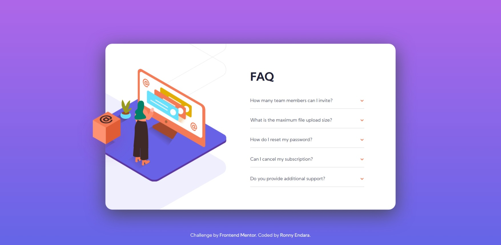
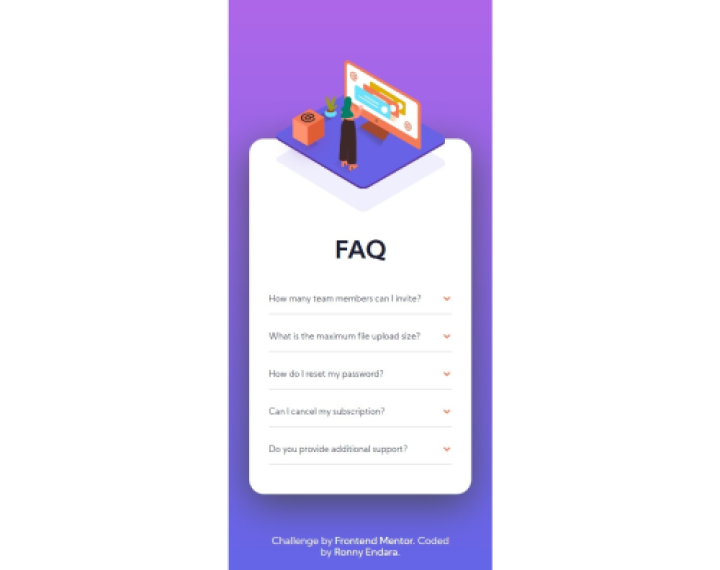

# Frontend Mentor - FAQ accordion card solution

This is a solution to the [FAQ accordion card challenge on Frontend Mentor](https://www.frontendmentor.io/challenges/faq-accordion-card-XlyjD0Oam). Frontend Mentor challenges help you improve your coding skills by building realistic projects. 

## Table of contents

- [Overview](#overview)
  - [The challenge](#the-challenge)
  - [Screenshot](#screenshot)
  - [Links](#links)
- [My process](#my-process)
  - [Built with](#built-with)
  - [What I learned](#what-i-learned)
- [Author](#author)

## Overview

### The challenge

Users should be able to:

- View the optimal layout for the component depending on their device's screen size
- See hover states for all interactive elements on the page
- Hide/Show the answer to a question when the question is clicked

### Screenshot

Desktop


Mobile


### Links

- Live Site URL: [Faq accordion card](https://rojaence.github.io/FrontendMentor-Challenges/faq-accordion-card)

## My process

### Built with

- Semantic HTML5 markup
- Flexbox
- CSS Grid
- Normalize CSS
- Mobile-first workflow

### What I learned

Trigger a CSS animation from JavaScript

```css
// Accordion active state
.card__accordion--active {
  .card__answer {
    display: block;
    animation: slide 0.3s;
  }
  .card__question {
      font-weight: 700;
  }
  .card__arrow {
    transform: rotate(180deg);
  }
}

@keyframes slide {
  0% {
    transform: scale(1, 0);
  }
  100% {
    transform: scale(1, 1);
  }
}
```
```js
const cardBody = document.getElementById("card-body");
const targetsClassList = ["card__question", "card__arrow"];

cardBody.addEventListener("click", (e) => {
  if (targetsClassList.includes(e.target.classList[0])){ 
      e.target.parentElement.classList.toggle("card__accordion--active");
  }
});
```

## Author

- Frontend Mentor - [@rojaence](https://www.frontendmentor.io/profile/rojaence)

