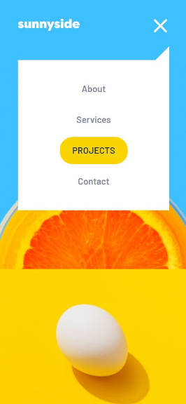

# Frontend Mentor - Sunnyside agency landing page solution

This is a solution to the [Sunnyside agency landing page challenge on Frontend Mentor](https://www.frontendmentor.io/challenges/sunnyside-agency-landing-page-7yVs3B6ef). Frontend Mentor challenges help you improve your coding skills by building realistic projects.

## Table of contents

- [Overview](#overview)
  - [The challenge](#the-challenge)
  - [Screenshots](#screenshots)
  - [Links](#links)
- [My process](#my-process)
  - [Built with](#built-with)
  - [What I learned](#what-i-learned)
- [Author](#author)

## Overview

### The challenge

Users should be able to:

- View the optimal layout for the site depending on their device's screen size
- See hover states for all interactive elements on the page

### Screenshots

Desktop


Mobile


Mobile menu




### Links

- Solution URL: [Frontend Mentor](https://www.frontendmentor.io/solutions/sunnyside-agency-landing-page-pQ3tenCdX)
- Live Site URL: [Github Pages](https://rojaence.github.io/FrontendMentor-Challenges/sunnyside-agency-landing-page/)

## My process

### Built with

- Semantic HTML5 markup
- CSS custom properties
- Flexbox
- CSS Grid
- Normalize CSS
- Sass
- Mobile-first workflow

### What I learned

I learned how to use the 'dataset' attribute to add or remove the classes that open or close the main menu through a switch in js

```html
<div class="menu-button" id="menu-button" data-menu="main-menu-button">
    <div class="menu-button__icon" data-menu="main-menu-button"></div>
</div>
<nav class="main-nav" id="main-nav" aria-label="Main menu" data-menu="main-menu">
  <ul class="main-nav__list" data-menu="main-menu">
    <li class="main-nav__item" data-menu="main-menu">
      <a href="#" class="main-nav__link" data-menu="main-menu">About</a>
    </li>
    <li class="main-nav__item" data-menu="main-menu">
      <a href="#" class="main-nav__link" data-menu="main-menu">Services</a>
    </li>
    <li class="main-nav__item" data-menu="main-menu">
      <a href="#" class="main-nav__link" data-menu="main-menu">Projects</a>
    </li>
    <li class="main-nav__item" data-menu="main-menu">
      <a href="#" class="main-nav__link" data-menu="main-menu">Contact</a>
    </li>
  </ul>
</nav>
```
```js
window.addEventListener("click", (e) => {
  switch (e.target.dataset.menu) {
    case "main-menu-button":
      mainNav.classList.contains("main-nav--active")
        ? (mainNav.classList.remove("main-nav--active"),
          menuButton.classList.remove("menu-button--active"))
        : (mainNav.classList.add("main-nav--active"),
          menuButton.classList.add("menu-button--active"));
      break;
    case "main-menu":
      mainNav.classList.add("main-nav--active");
      menuButton.classList.add("menu-button--active");
      break;
    default:
      mainNav.classList.remove("main-nav--active");
      menuButton.classList.remove("menu-button--active");
  }
```

## Author

- Frontend Mentor - [@rojaence](https://www.frontendmentor.io/profile/rojaence)
- Twitter - [@EndaraRonny](https://www.twitter.com/EndaraRonny)
